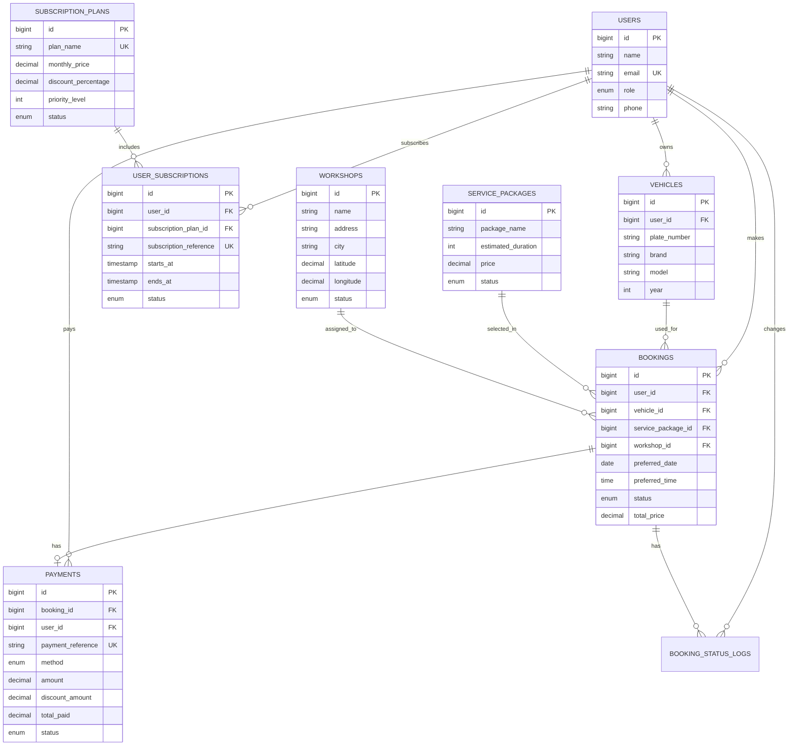

# Entity Relationship Diagram Description

## Normalisation Notes

- User data is stored once in `users` and referenced by vehicles, bookings, payments and subscriptions.
- Vehicle records are separated from bookings to prevent repeating plate, brand and model in every booking.
- Service package price and duration are stored in `service_packages`; booking stores `total_price` as a transaction snapshot.
- Workshop location is separated into `workshops` so customers can search nearby locations and bookings can reference one workshop.
- Payment is separated from booking because not all bookings are paid immediately.
- Subscription plans are separated from user subscriptions so admin can manage reusable plan definitions.
